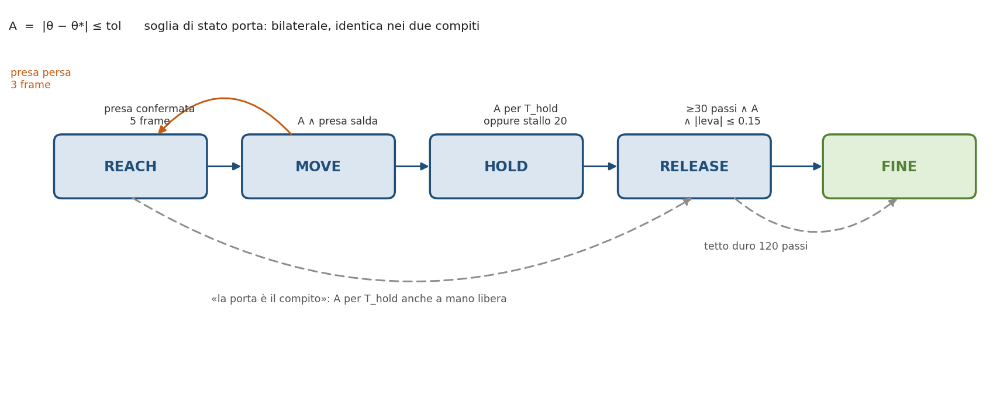
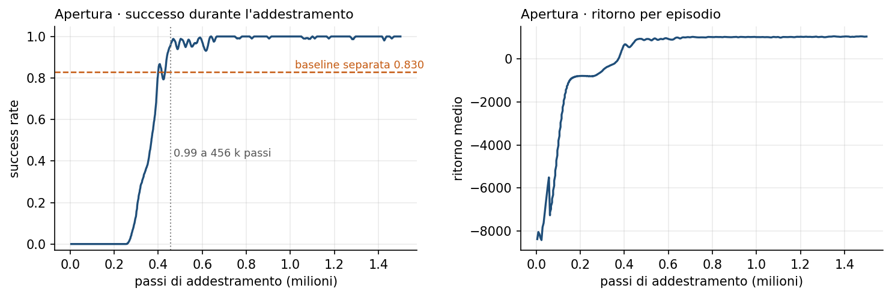
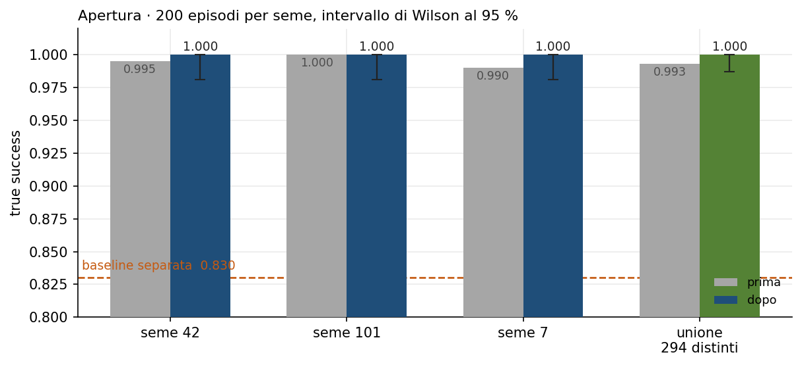
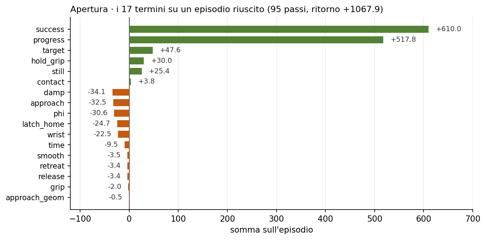
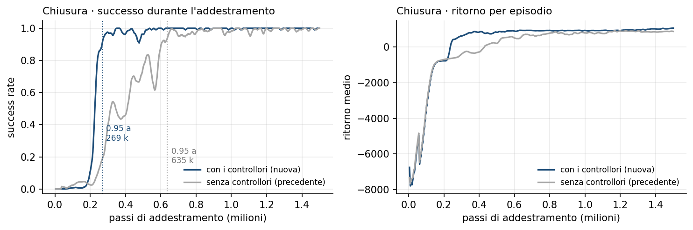
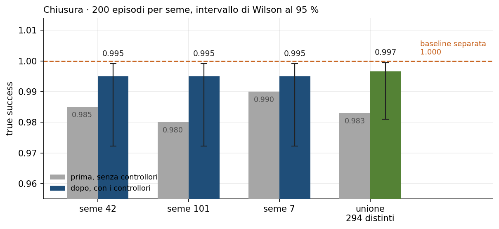
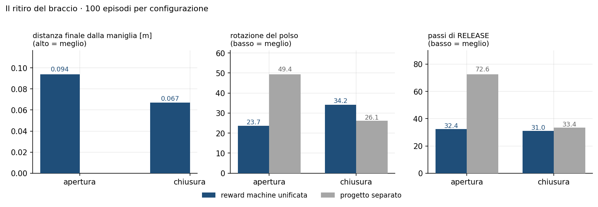

# La reward machine unificata

Una sola reward machine risolve **apertura v2 curr 1** e **chiusura v2 curr 1**.

Principio: *la chiusura è l'apertura con bersaglio zero*. Fra i due compiti **non
cambia nessun peso e nessuna soglia**, e alla fine restano **quattro** parametri
diversi su nove — bersaglio, partenza, tolleranza, tempo di mantenimento — cioè
esattamente la **specifica** del compito. Tutto il resto, geometria e
controllori, è identico (§4).

| | apertura | chiusura |
|:---|---:|---:|
| **true success** (294 episodi distinti) | **0.993** | **0.997** |
| baseline: progetto separato | 0.830 | 1.000 |
| **clean success** (per seme) | 0.990 – 1.000 | **0.995** |
| rettilineità del ritiro | **0.900** | **0.860** |

---

## 1. La macchina



`A` significa **porta al bersaglio**: `|θ − θ*| ≤ tol`. È **bilaterale** — vale
uguale se la porta è corta o se ha superato il bersaglio — ed è la stessa
condizione nei due compiti. La macchina la usa in cinque punti.

| transizione | condizione |
|:---|:---|
| REACH → MOVE | presa confermata per **5** frame consecutivi |
| MOVE → REACH | presa persa, con isteresi, per **3** frame |
| MOVE → HOLD | **A ∧ gripper ≥ soglia ∧ dita chiuse** |
| REACH/MOVE → RELEASE | **A per T_hold frame**, comunque sia messa la mano |
| HOLD → RELEASE | timer ≥ T_hold, **oppure** stallo a **20** frame cumulativi fuori tolleranza |
| RELEASE → FINE | ≥ **30** passi ∧ A ∧ \|leva\| ≤ 0.15, **oppure** tetto duro a **120** passi |

Tre proprietà non ovvie, tutte necessarie:

- **il gate è bilaterale**, quindi la sovra-apertura non passa;
- **la guardia di stallo conta in modo cumulativo**: azzerandola a ogni frame
  dentro tolleranza, una porta che oscilla terrebbe a zero sia il timer sia la
  guardia e HOLD non finirebbe mai;
- **la porta è il compito**: se `A` regge per T_hold frame senza passare da
  HOLD si va comunque in RELEASE. Senza questa riga esistono stati da cui FINE
  è irraggiungibile.

---

## 2. I 17 termini

| # | termine | che cosa fa | fasi | peso |
|---:|:---|:---|:---|:---|
| 1 | `time` | costo del tempo | sempre | 0.1 |
| 2 | `smooth` | movimento fluido | sempre | 0.1 · 0.005 |
| 3 | `phi` | shaping potenziale (§3) | sempre | taglio ±10 |
| 4 | `approach` | avvicina la mano alla maniglia | REACH, MOVE | 5 · 3 · 15 |
| 5 | `approach_geom` | non arrivare da sotto né dall'alto | REACH | 3.0 · 1.5 |
| 6 | `wrist` | orienta il polso, solo da vicino | REACH, HOLD | 1.5 · 0.5 · 2.0 |
| 7 | `grip` | solo costi: non chiudere presto, non mollare | REACH, MOVE | 1.0 · 2.0 |
| 8 | `progress` | **il motore del compito** (§3) | MOVE | budget 700 |
| 9 | `contact` | contatto vero *mentre* la porta si muove | MOVE | 0.5 |
| 10 | `target` | precisione sul bersaglio, punisce chi lo supera | HOLD, RELEASE | 1.0 · 20.0 |
| 11 | `damp` | ferma la porta sul bersaglio | HOLD | 25.0 |
| 12 | `still` | tieni fermo il braccio | HOLD, RELEASE | 1 · 2 · 1 · 20 |
| 13 | `hold_grip` | salute della presa | HOLD | 1 · 5 · 2 · 10 · 3 |
| 14 | `release` | apri la mano al momento giusto | RELEASE | 2.0 · 1.0 · 1.0 |
| 15 | `retreat` | allontanati dritto dalla porta | RELEASE | 3 · 2 · 3 |
| 16 | `latch_home` | riporta la maniglia a riposo | RELEASE | 1.0 |
| 17 | `success` | **+10** alla prima uscita da REACH · **+600** a compito finito | transizione, terminale | 10 · 600 |

La somma di ogni passo è tagliata a **±100**, tranne al passo terminale:
altrimenti i 600 arriverebbero alla politica come 100. `success` si paga **una
volta sola** per episodio.

---

## 3. Il budget di `progress` e lo shaping

Percorrere tutta la corsa paga **700** in entrambi i compiti. Il punto delicato
è **come** si ripartisce fra i due tratti — girare la maniglia e muovere la
porta — perché è il numero che da solo decide quale compito si risolve.

Il catenaccio blocca la porta in **entrambi** i versi: a maniglia ferma si
arresta a 0.182 rad chiudendo e a 0.015 aprendo. Girare la maniglia è quindi
lavoro utile in tutti e due i casi.

| ripartizione | gradiente sulla porta | budget maniglia | chiusura | apertura |
|:---|---:|---:|:---|:---|
| un budget solo | 458 /rad | 563 | 1.00 | 0.21, in calo |
| maniglia esclusa | 2333 /rad | 0 | **0.05** | 0.37 |
| **`quota_leva = 0.30`** | **1257–1311 /rad** | **210** | **0.997** | **0.993** |

Sommare i due tratti in una sola escursione li mette **in concorrenza**: la
maniglia ha una corsa di 1.23 rad contro i ~0.37 della porta, quindi si prende
l'80 % del budget. Alla chiusura va bene; all'apertura, dove la porta *è* il
compito, resta troppo poco segnale. Togliendo la maniglia l'apertura riparte ma
la chiusura si pianta contro il catenaccio — misurato, 18 valutazioni su 20
ferme a errore +0.1755, sempre identico. Ogni tratto riceve quindi **un budget
suo**: la maniglia è un mezzo, la porta è il fine.

**Lo shaping** è potenziale [Ng, Russell & Harada 1999], dipendente dalla fase
[Devlin & Kudenko 2012]: `F = γ·Φ(s′) − Φ(s)` con γ = 0.95 e taglio ±10. Φ vale
zero in REACH e cresce a gradini: ogni fase superata entra al suo massimo, così
la scala non scende cambiando fase. Il premio per stringere la maniglia vive
**dentro Φ**, non nella ricompensa: negli originali era pagato a ogni passo e
restare sulla maniglia senza fare nulla rendeva quasi quanto risolvere il
compito. Dentro Φ conserva lo stesso gradiente ma a comando costante vale
`−(1−γ)Φ < 0`, quindi non è più mungibile.

---

## 4. Che cosa distingue i due compiti

I nove parametri di `TaskSpec`. **Nessuno è un termine di ricompensa.** Di questi,
**solo quattro** distinguono ancora i due compiti, e sono i quattro che dicono
*che cosa si vuole ottenere*:

| parametro | apertura | chiusura | |
|:---|:---|:---|:---|
| bersaglio θ\* (frazione della corsa) | 0.85–1.00, campionato a ogni reset | 0.015 fisso | **diverso** |
| partenza θ₀ | 0.0 | 0.70–1.00 | **diverso** |
| tolleranza | 0.05 rad | 0.03 rad | **diverso** |
| tempo di mantenimento | 1.0 s | 2.0 s | **diverso** |
| distanza di ritiro | 0.25 m | 0.25 m | uguale |
| alzata nel ritiro | 0.0 | 0.0 | uguale |
| ritiro lungo la normale orientata | sì | sì | uguale |
| riporto attivo della maniglia | sì | sì | uguale |
| controllore di fuga | sì | sì | uguale |

I cinque parametri di geometria e controllo sono diventati identici: dare alla
chiusura gli stessi controllori dell'apertura è ciò che ha portato la chiusura da
0.983 a **0.997** e il suo ritiro da 0.654 a **0.860** (§9 e §10).

**Il verso della maniglia** è anch'esso comune ai due compiti, perché è geometria
della porta: la maniglia si **abbassa**, come nel mondo reale. Sul modello MuJoCo
il giunto `Door_latch_joint` porta la maniglia a z = 1.000 con leva +1.5 e a
z = 1.150 con leva −1.5, contro z = 1.075 a riposo. Il tratto di leva conta in
`progress` **solo nel verso positivo**: senza questa specifica alzare e abbassare
valgono identico e il segno lo decide l'inizializzazione della rete — misurato,
un addestramento è finito a −1.506, cioè con la maniglia alzata, in 40 episodi su
40. Con la specifica, entrambi i modelli la abbassano in 40 su 40.

**SAC è invariato** rispetto agli originali: rete (512, 512), lr 3·10⁻⁴, γ 0.95,
buffer 10⁶, batch 256, τ 0.005, 8 ambienti, orizzonte 600, 30 Hz. L'unico valore
per compito è `target_entropy` (+1.0 apertura, −3.0 chiusura): appartiene
all'ottimizzatore, non alla reward machine.

I controllori — blocco del braccio in HOLD, morsa sulla presa, riporto della
maniglia, fuga — **non sono ricompensa**: sostituiscono l'azione prima che
raggiunga il simulatore, e i termini che dipendono da un'azione non più libera
sono **mascherati**, in un punto solo del codice.

---

## 5. Come si misura il successo

Tre livelli, gli stessi della tesi (§6.3.4):

| livello | definizione |
|:---|:---|
| **permissivo** | la politica ha raggiunto la fase di mantenimento |
| **true** | a fine episodio la porta è al bersaglio **e** la maniglia è tornata a riposo |
| **clean** | in più, la mano si è allontanata di **≥ 6 cm** da dove ha lasciato la maniglia, e l'episodio è terminato **per condizione soddisfatta**, non per tetto duro |

`true success` è la metrica di confronto, perché è quella con cui si misura la
baseline. Gli intervalli sono di **Wilson al 95 %**.

---

## 6. Apertura — addestramento



| | valore |
|:---|---:|
| budget | 1 500 000 passi |
| success rate ≥ 0.95 | a **446 k** passi |
| success rate ≥ 0.99 | a **456 k** passi |
| success rate finale | **1.000** |
| ritorno medio finale | +1049 |
| lunghezza media finale | 95.2 passi |

La politica supera la baseline separata (0.830) a poco più di **un quarto** del
budget, e da 0.6 M passi in poi resta piatta a 1.000.

---

## 7. Apertura — valutazione, 200 episodi per seme



| seme | permissivo | **true** | **clean** | \|errore\| medio | passi | ritorno | ritiro |
|---:|---:|---:|---:|---:|---:|---:|---:|
| 42 | 1.000 | 0.995 | 0.995 | 0.0249 | 96.09 | +1039.4 | 0.166 m |
| 101 | 1.000 | **1.000** | **1.000** | 0.0234 | 95.53 | +1044.0 | 0.165 m |
| 7 | 1.000 | 0.990 | 0.990 | 0.0250 | 96.36 | +1040.1 | 0.166 m |

I tre semi concordano a meno di un episodio: il risultato non dipende da quali
porte vengono provate.

**Stima complessiva.** I semi 7, 42 e 101 su 200 episodi coprono gli episodi
7–206, 42–241 e 101–300: si sovrappongono, quindi le 600 esecuzioni
corrispondono a **294 episodi distinti**. La stima va fatta su questi.

| | true success | IC 95 % (Wilson) |
|:---|---:|:---|
| **apertura, macchina unificata** | **0.993** (292/294) | **[0.976, 0.998]** |
| apertura, progetto separato | 0.830 (166/200) | [0.772, 0.876] |
| riferimento banale (apre sempre a fondo corsa) | 0.805 | — |

**Gli intervalli non si toccano**: il miglioramento non è rumore di
campionamento. Ma il numero che conta di più è il **segno dell'errore**: la
baseline sbaglia sistematicamente in eccesso (+0.0243) perché apre sempre fino
al fine corsa — è quasi la politica banale. Qui l'errore medio è **−0.0193**,
distribuito sui due lati: la porta si **ferma al bersaglio**. Si batte il
riferimento banale per la ragione giusta.

**I due fallimenti su 294** hanno la stessa firma: la porta si ferma corta di
~0.18 rad, la maniglia è a posto.

| episodio | passi | errore | leva |
|---:|---:|---:|---:|
| 7 | 189 | −0.1848 | −0.023 |
| 74 | 186 | −0.1740 | −0.011 |

---

## 8. Apertura — un episodio, transizione per transizione

Episodio riuscito: 95 passi, ritorno **+1067.9**, errore finale −0.0427,
leva +0.097.

| fase | passi | R | R/passo | termini principali |
|:---|---:|---:|---:|:---|
| REACH | 17 | −36.0 | −2.12 | `approach` −28.6 · `wrist` −3.9 · `grip` −2.0 |
| MOVE | 16 | **+525.6** | +32.85 | `progress` +517.8 · `success` +10.0 · `contact` +3.8 |
| HOLD | 30 | +11.6 | +0.39 | `damp` −34.1 · `hold_grip` +30.0 · `target` +26.2 · `still` +25.4 |
| RELEASE | 31 | −32.6 | −1.05 | `latch_home` −24.7 · `target` +21.4 · `phi` −18.5 |
| FINE | 1 | **+599.2** | +599.19 | `success` +600.0 |

La struttura si legge in una riga: REACH costa poco e dura poco, MOVE incassa il
budget di `progress`, HOLD mantiene, RELEASE paga il ritiro e riporta la
maniglia, FINE riscuote i 600.



| termine | somma | termine | somma | termine | somma |
|:---|---:|:---|---:|:---|---:|
| `success` | +610.0 | `phi` | −30.6 | `smooth` | −3.5 |
| `progress` | +517.8 | `hold_grip` | +30.0 | `retreat` | −3.4 |
| `target` | +47.6 | `still` | +25.4 | `release` | −3.4 |
| `damp` | −34.1 | `latch_home` | −24.7 | `grip` | −2.0 |
| `approach` | −32.5 | `wrist` | −22.5 | `approach_geom` | −0.5 |
| | | `time` | −9.5 | `contact` | +3.8 |

Due termini valgono il 92 % del bilancio positivo — `success` e `progress` — e
nessun termine negativo supera i 35 punti: la macchina premia il compito e usa
il resto per correggere la forma del movimento, non per competere con
l'obiettivo.

---

## 9. Chiusura — addestramento e valutazione



| | senza controllori | **con i controllori** |
|:---|---:|---:|
| success rate ≥ 0.95 | 635 k passi | **269 k passi** |
| success rate ≥ 0.99 | 645 k passi | **330 k passi** |
| success rate finale | 1.000 | 1.000 |
| ritorno medio finale | +885 | **+1066** |
| lunghezza media finale | 141.2 passi | **121.9 passi** |

Con i controllori la chiusura impara in **meno della metà** dei passi e in un
episodio più corto.



| seme | permissivo | **true** | **clean** | \|errore\| medio | passi | ritorno | ritiro |
|---:|---:|---:|---:|---:|---:|---:|---:|
| 42 | 0.995 | **0.995** | **0.995** | 0.0074 | 124.30 | +1032.7 | 0.138 m |
| 101 | 0.995 | **0.995** | **0.995** | 0.0074 | 124.22 | +1023.0 | 0.137 m |
| 7 | 0.995 | **0.995** | **0.995** | 0.0075 | 124.21 | +1035.4 | 0.138 m |

I tre semi danno **lo stesso identico valore**. Rispetto alla versione senza
controllori (0.985 / 0.980 / 0.990 di true e 0.975 / 0.960 / 0.975 di clean),
**true e clean salgono su tutti e tre i semi**: la regola di adozione era
esattamente questa.

| | true success | IC 95 % (Wilson) |
|:---|---:|:---|
| **chiusura, macchina unificata** | **0.997** (293/294) | **[0.981, 0.999]** |
| chiusura, versione precedente | 0.983 (289/294) | [0.961, 0.993] |
| chiusura, progetto separato | 1.000 (100/100) | [0.963, 1.000] |

**Resta un solo fallimento su 294**, e non è più la maniglia:

| episodio | passi | errore | leva | |
|---:|---:|---:|---:|:---|
| 163 | 600 | +0.3940 | −0.017 | la porta non arriva al bersaglio; la maniglia è a posto |

Prima i fallimenti erano cinque e **quattro riguardavano la leva** — porta chiusa
alla perfezione, maniglia ancora girata (+1.674, +1.284, +1.572, +0.724). Con il
riporto attivo della maniglia sono spariti tutti.

Lo stesso episodio letto dal lato della ricompensa (121 passi, ritorno +1163.5):

| fase | passi | R | R/passo | termini principali |
|:---|---:|---:|---:|:---|
| REACH | 14 | −31.7 | −2.26 | `approach` −22.7 · `grip` −5.4 · `wrist` −2.1 |
| MOVE | 16 | **+522.3** | +32.64 | `progress` +512.5 · `success` +10.0 · `contact` +4.7 |
| HOLD | 60 | +70.9 | +1.18 | `hold_grip` +60.0 · `still` +54.8 · `target` +47.6 |
| RELEASE | 30 | **+2.8** | +0.09 | `target` +25.4 · `phi` −17.6 · `latch_home` −15.4 · `release` +11.5 |
| FINE | 1 | **+599.2** | +599.24 | `success` +600.0 |

**La fase RELEASE passa da −111.1 a +2.8**, e il termine `retreat`, che prima
costava −153.5 per episodio, ora vale **+2.9**. Il ritiro non è più un movimento
che la macchina paga: è un movimento che la macchina premia. È la firma del fatto
che la direzione di fuga adesso punta dove il braccio va davvero.

---

## 10. Il ritiro del braccio

Quattro grandezze misurate sulla fase RELEASE, 100 episodi per configurazione:
**rettilineità** = spostamento netto / lunghezza del percorso (1.0 è una fuga in
linea retta, 0.5 significa che metà del moto si annulla su sé stesso),
**rotazione del polso** sommata sulla fase, **passi** di RELEASE.



| | rettilineità | rotazione | passi | verdetto |
|:---|---:|---:|---:|:---|
| **apertura** unificata | **0.900** | **23.7** | **31.7** | **meglio su tutto** |
| apertura separata | 0.657 | 49.4 | 72.6 | |
| **chiusura** unificata | **0.860** | 34.2 | **30.8** | alla pari, più veloce |
| chiusura separata | 0.894 | 26.1 | 33.4 | |
| *chiusura, versione precedente* | *0.654* | *37.9* | *30.1* | |

**L'apertura**: +37 % di rettilineità, metà della rotazione di polso, il ritiro
finisce in 32 passi invece di 73.

**La chiusura** era il caso aperto: 0.654 contro 0.894, cioè −27 %. Dando alla
chiusura gli stessi controllori dell'apertura è salita a **0.860**, e il divario
con il progetto separato è passato da −27 % a **−4 %**, con un ritiro più corto
in durata.

Il perché è strutturale. Prima, su 30 episodi di chiusura, durante RELEASE **il
controllore attivo era NESSUNO in 902 passi su 902**: la traiettoria era
interamente della politica e i parametri geometrici del ritiro entravano solo
nella ricompensa. Ora la ripartizione è quella dell'apertura — riporto della
maniglia e fuga si dividono la fase — e sono loro a rendere il ritiro pulito.

Lo spostamento netto scende da 0.191 m a **0.138 m**, perché il braccio non
vaga più: percorre 0.164 m invece di 0.297 m per allontanarsi quasi altrettanto.
Resta oltre il doppio della soglia di 6 cm che definisce il clean success, e
infatti il clean sale da 0.970 a 0.995.

---

## 11. Il bilancio rispetto alla baseline

| | baseline separata | macchina unificata | |
|:---|---:|---:|:---|
| apertura, true success | 0.830 | **0.993** | **+0.163**, intervalli disgiunti |
| apertura, errore medio con segno | +0.0243 | **−0.0193** | non satura più il fine corsa |
| apertura, rettilineità del ritiro | 0.657 | **0.900** | **+37 %** |
| apertura, passi di RELEASE | 72.6 | **31.7** | **−56 %** |
| chiusura, true success | 1.000 | **0.997** | un episodio su 294, intervalli sovrapposti |
| chiusura, clean success | — | **0.995** | su tutti e tre i semi |
| chiusura, errore assoluto | — | 0.0074 rad | un quarto di quello dell'apertura |
| chiusura, rettilineità del ritiro | 0.894 | 0.860 | da −27 % a **−4 %** |
| chiusura, passi per episodio | — | 124.2 | **−12 %** rispetto ai 141.1 di prima |
| codice | due progetti separati | **una macchina, 17 termini** | stessi pesi, quattro parametri diversi |

**L'apertura era il compito irrisolto della tesi** — 83.0 % — ed è risolta al
99.3 %, con intervalli di confidenza disgiunti e un movimento migliore sotto ogni
grandezza misurata.

**La chiusura era già risolta al 100 %** dal progetto dedicato, e la macchina
unificata la riproduce al **99.7 %**: un solo episodio su 294, e non è più un
fallimento sulla maniglia ma una porta che non arriva al bersaglio. Gli
intervalli — [0.981, 0.999] contro [0.963, 1.000] — si sovrappongono quasi per
intero: sui dati disponibili le due soluzioni non sono distinguibili.

Il punto della tesi, però, non è il pareggio: è che **una sola specifica, con gli
stessi 17 termini e gli stessi pesi, ottiene su entrambi i compiti quello che due
progetti separati ottenevano su uno solo ciascuno** — e sull'apertura fa
nettamente meglio.

---

## 12. Come riprodurre le misure

```bash
cd unified_door
export PROGETTI_ORIGINALI="$(cd .. && pwd)"

# valutazione a tre semi, 200 episodi ciascuno
python3 train_unified.py --task open  --eval --eval-seeds 42,101,7 --episodes 200
python3 train_unified.py --task close --eval --eval-seeds 42,101,7 --episodes 200

# un episodio a schermo, con transizioni e bilancio dei termini
mjpython train_unified.py --task open  --play --slow 2
mjpython train_unified.py --task close --play

# verifica dell'implementazione contro questo documento
python3 tests/test_unified.py        # 240 controlli
```

I risultati completi sono in `risultati_apertura.txt`, `risultati_chiusura.txt`
e `risultati_chiusura_addestramento.txt`.
